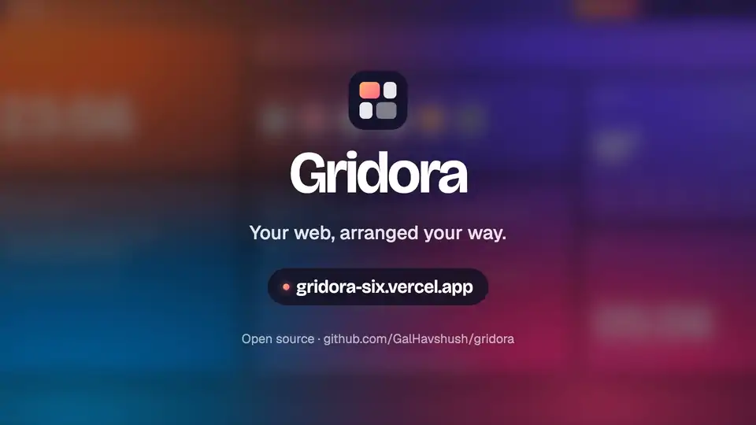
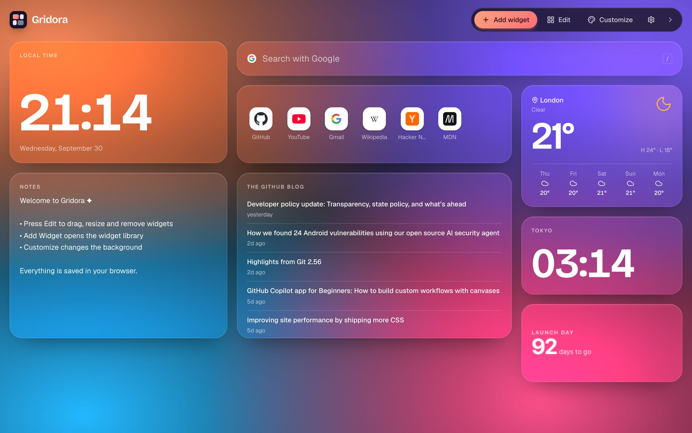
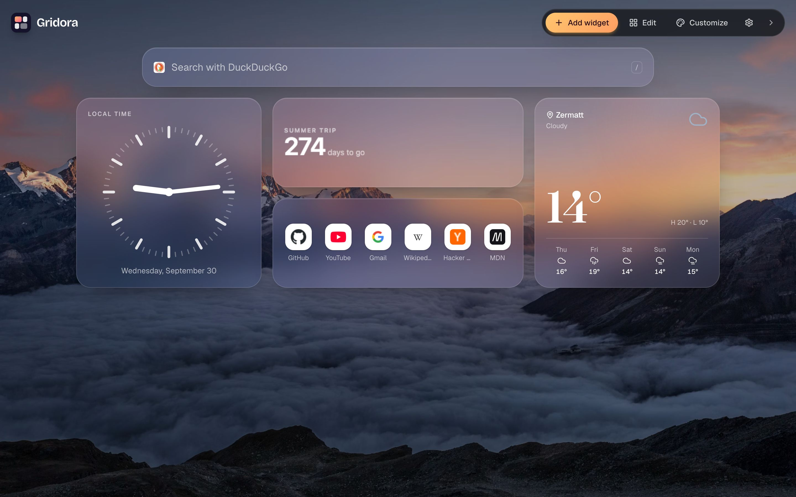
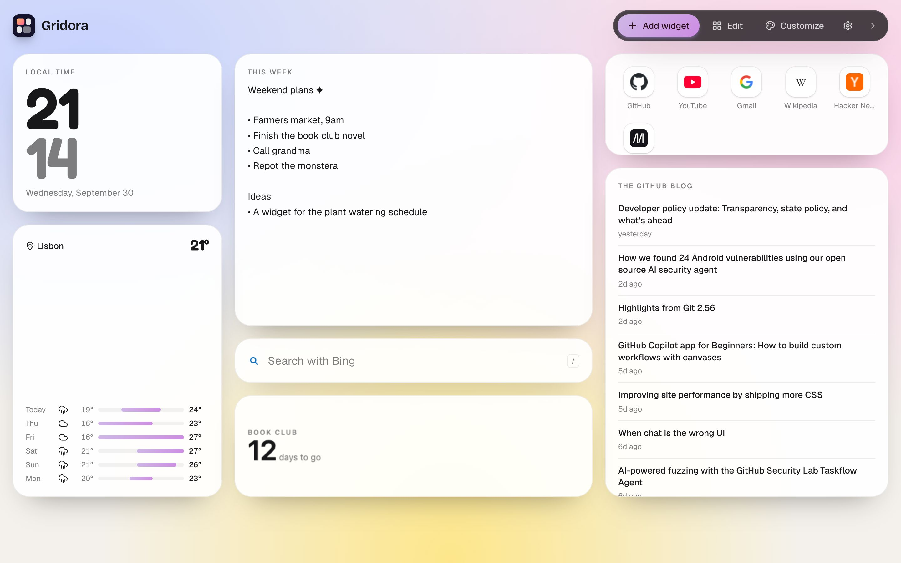
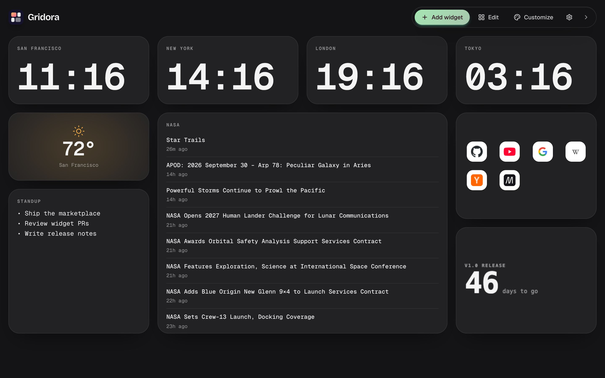
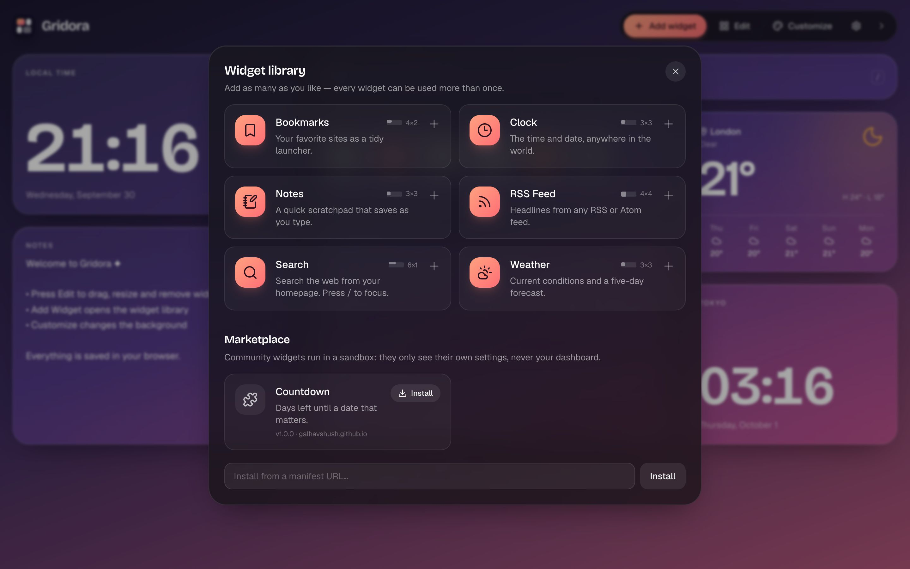
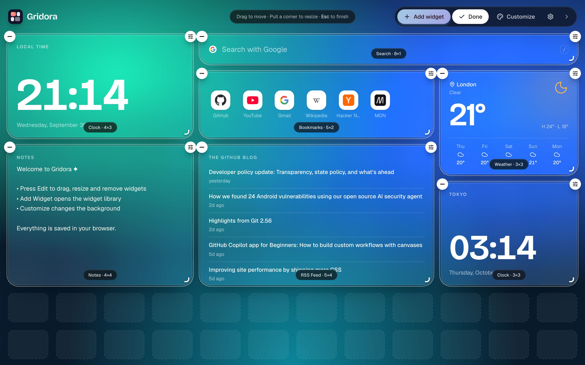
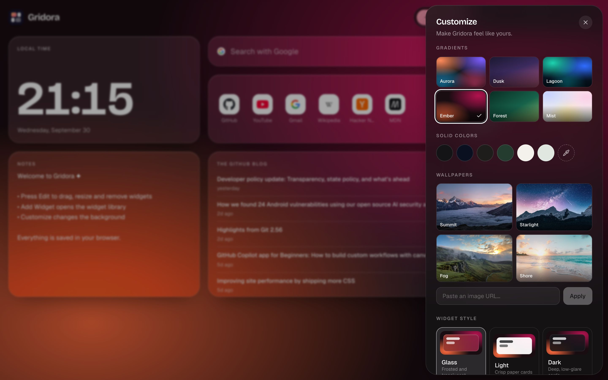
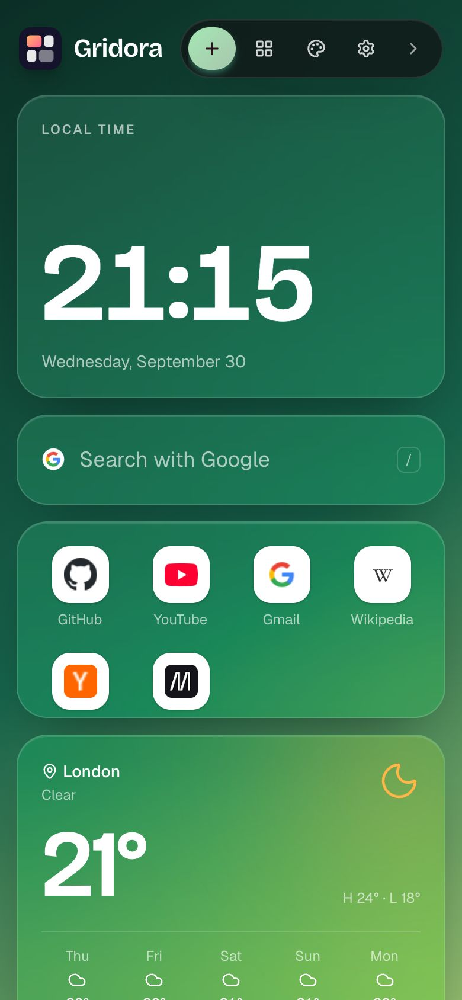

# Gridora

**Your web, arranged your way.**

> [!WARNING]
> **Gridora is a work in progress.** Expect bugs and breaking changes between versions, including to the saved dashboard format. Found a problem? [Open an issue](https://github.com/GalHavshush/gridora/issues).

Gridora is an open-source, widget-based personal homepage, a modern spiritual successor to iGoogle. Arrange clocks, weather, notes, bookmarks, feeds and search on a full-screen snapping grid, install more widgets from the community marketplace, and restyle everything. It all stays in your browser.

<a href="https://gridora-six.vercel.app"></a>

<p align="center"><a href="https://gridora-six.vercel.app"><b>Try the live demo →</b></a></p>

## Features

- **Snapping 12-column grid:** drag to move, pull a corner to resize, and every widget lands on the grid.
- **Widget marketplace:** install community widgets in one click, without rebuilding anything. They run in a sandbox.
- **Multiple instances:** two clocks in different time zones, three feeds, as many notes as you like.
- **Make it yours:** gradients, solid colors or wallpapers; glass, light or dark cards; six fonts, six accent colors and custom card colors.
- **Works everywhere:** the layout keeps its proportions from laptop to tablet and stacks into one column on phones.
- **No backend, no accounts:** a static site. Everything is saved in `localStorage` and can be exported or imported as JSON.

## Screenshots



<table>
  <tr>
    <td width="50%"><br /><sub><b>Wallpapers.</b> Photo backgrounds with glass cards, a serif font and an amber accent.</sub></td>
    <td width="50%"><br /><sub><b>Light mode.</b> Paper cards on a pastel gradient; text adapts automatically.</sub></td>
  </tr>
  <tr>
    <td width="50%"><br /><sub><b>Dark and minimal.</b> A world-clock row with mono type and matte dark cards.</sub></td>
    <td width="50%"><br /><sub><b>Marketplace.</b> Built-in widgets and community widgets in one library.</sub></td>
  </tr>
  <tr>
    <td width="50%"><br /><sub><b>Edit mode.</b> Drag, resize and snap to the cell grid.</sub></td>
    <td width="50%"><br /><sub><b>Customize.</b> Backgrounds, card styles, fonts and accents.</sub></td>
  </tr>
</table>

<p align="center">
  <br />
  <sub><b>Small screens.</b> Widgets stack into one column.</sub>
</p>

## Widget marketplace

Open **Add widget** and scroll to **Marketplace** to install community widgets from [gridora-widgets](https://github.com/GalHavshush/gridora-widgets). Installed widgets join the library, so you can add them as often as you like, configure each copy, and uninstall them from the same place. To install a widget that isn't listed, paste its `manifest.json` URL into **Install from a manifest URL**.

Community widgets run in a sandboxed frame. They only see their own settings and the current theme colors, never your dashboard, your other widgets or your browser storage.

**Want to publish a widget?** A marketplace widget is a small web page plus a manifest. Add it to [gridora-widgets](https://github.com/GalHavshush/gridora-widgets) with a pull request, and once it's merged it appears in everyone's Marketplace. That repo's README walks you through it.

## Built-in widgets

| Widget    | Notes                                                                                           |
| --------- | ----------------------------------------------------------------------------------------------- |
| Clock     | Digital, analog or stacked; 12/24-hour; any time zone; custom label                             |
| Weather   | Live data from [Open-Meteo](https://open-meteo.com) (free, no API key); classic, minimal or week |
| Notes     | Autosaves per instance                                                                          |
| Bookmarks | Launcher grid with favicons, or your own emoji or image icons                                   |
| RSS Feed  | RSS 2.0 and Atom, any public feed                                                               |
| Search    | Google, Bing or DuckDuckGo. Press `/` to focus                                                  |

Many feeds don't send the CORS headers that browsers need. Gridora reads feeds directly when it can and otherwise falls back to [rss2json.com](https://rss2json.com), a free public service. All of this logic is in `src/services/rss/fetchFeed.ts`.

## Quick start

```bash
git clone https://github.com/GalHavshush/gridora.git
cd gridora
npm install
npm run dev
```

| Script            | What it does                    |
| ----------------- | ------------------------------- |
| `npm run dev`     | Start the dev server            |
| `npm run build`   | Type-check and build to `dist/` |
| `npm run preview` | Serve the production build      |
| `npm test`        | Run the unit tests (Vitest)     |
| `npm run lint`    | Lint with oxlint                |

**Deploy:** `npm run build` produces a fully static `dist/` folder.
- **Vercel:** import the repo; the Vite preset works as-is.
- **Cloudflare Pages:** build command `npm run build`, output directory `dist`.
- **Anywhere else:** any static host works.

**Tech stack:** React 19 · TypeScript · Vite · Tailwind CSS v4 · Zustand · react-grid-layout v2 · Motion · lucide icons

## For developers

### Architecture

```
src/
  app/            Screens and panels: Dashboard, WidgetGrid, WidgetPicker, settings/customize drawers
  components/     Shared UI: WidgetContainer (widget chrome), Toolbar, Sheet, SettingField, Background
  widget-sdk/     The contract between Gridora and widgets: types, registry, helpers, and
                  remote.ts + RemoteWidget.tsx for marketplace widgets
  widgets/        One folder per built-in widget (clock, weather, notes, bookmarks, rss, search)
  store/          Zustand dashboard store, layout helpers, snapshot validation
  services/       Side effects behind small seams: persistence, weather provider, RSS fetching
  themes/         Background presets, card styles, fonts and accents
```

**How a widget gets on screen:**

1. `widget-sdk/registry.ts` collects every `src/widgets/*/manifest.ts` with `import.meta.glob`, so there's no central list to edit. Installed marketplace widgets are registered alongside them at runtime.
2. The store holds **widget instances** of the form `{ id, type, position: { x, y, w, h }, settings }`. `type` points at a manifest, and `id` is unique per instance (`notes-a81b2`).
3. `WidgetGrid` maps the instances to a react-grid-layout layout and renders each one inside a `WidgetContainer`.
4. `WidgetContainer` merges the manifest's default settings with the stored ones and renders the widget. It also provides the card surface, the edit controls, and an error boundary so one broken widget can't take down the page.
5. Dragging and resizing update the store, which persists itself automatically.

**State and persistence.** `store/dashboardStore.ts` is a single Zustand store. Its persisted part (a `DashboardSnapshot`) is saved through `services/persistence/storage.ts`, the only file that touches `localStorage`. To add cloud sync, implement another Zustand `StateStorage` there; the UI won't change.

**Responsive behavior.** Screens 640 px and wider use the 12-column grid, and row height scales with width. On narrower screens the saved layout is shown as a single-column stack, and the desktop arrangement is left untouched.

### Create a built-in widget

A built-in widget is a folder with a component and a manifest. Here's a complete "Counter" widget.

**1. `src/widgets/counter/CounterWidget.tsx`**

```tsx
import type { WidgetProps } from '@/widget-sdk'

export type CounterSettings = { label: string; count: number }

export function CounterWidget({ settings, updateSettings }: WidgetProps<CounterSettings>) {
  return (
    <div className="flex h-full flex-col items-center justify-center gap-2 p-5">
      <div className="text-sm text-muted">{settings.label}</div>
      <button
        className="font-display text-5xl font-semibold"
        onClick={() => updateSettings({ count: settings.count + 1 })}
      >
        {settings.count}
      </button>
    </div>
  )
}
```

**2. `src/widgets/counter/manifest.ts`**

```ts
import { Plus } from 'lucide-react'
import { defineWidget } from '@/widget-sdk'
import { CounterWidget, type CounterSettings } from './CounterWidget'

export default defineWidget<CounterSettings>({
  id: 'counter', // stored with every instance, so never rename it
  name: 'Counter',
  description: 'Counts things. Click to increment.',
  version: '1.0.0',
  icon: Plus,
  component: CounterWidget,
  defaultSize: { w: 2, h: 2 },
  minSize: { w: 2, h: 2 },
  settings: [
    { key: 'label', label: 'Label', type: 'text', default: 'Coffees today' },
    { key: 'count', label: 'Count', type: 'number', default: 0, min: 0 },
  ],
})
```

**3. That's it.** Run `npm run dev`. "Counter" now appears in the widget library, and its settings drawer is generated from the `settings` schema.

| Prop             | Description                                                                    |
| ---------------- | ------------------------------------------------------------------------------ |
| `settings`       | Stored settings merged over the defaults in your manifest                      |
| `updateSettings` | Shallow-merges and persists. You can also store content here (Notes does)      |
| `openSettings`   | Opens this instance's settings drawer, which is useful for empty states        |
| `isEditing`      | `true` in edit mode. Content isn't interactive then; the card is a drag handle |
| `size`           | Current size in grid cells, `{ w, h }`, for adapting the layout                |
| `instanceId`     | Unique id of this instance                                                     |

**Settings schema:** `text`, `url`, `number` (`min`/`max`/`step`), `toggle`, `select` (`options`), and `list`, an editable list of records described by `fields` (Bookmarks uses it).

**Guidelines:**
- **Theme-aware colors:** use `text-fg`, `text-muted`, `bg-subtle` and `border-line` so the widget looks right on glass, light and dark cards.
- **Size-aware layout:** the card is a CSS container, so scale type with `cqi` units (`font-size: clamp(2rem, 20cqi, 6rem)`) or branch on `size`.
- **Data fetching:** `useAsyncData(key, loader, refreshMs)` handles loading, errors, aborting and refreshes. Keep API calls in `src/services/`.
- **Empty and error states:** `WidgetMessage` renders a consistent message with an optional action.
- **No secrets:** anything you ship is public. Prefer keyless APIs, or let users enter their own keys in settings.

### Marketplace widget protocol

A marketplace manifest has the same fields as `defineWidget`, except that an `entry` URL takes the place of `component` and there's no icon. Gridora renders the entry page in an iframe with `sandbox="allow-scripts allow-popups allow-popups-to-escape-sandbox allow-forms"` and no `allow-same-origin`, so the page gets an opaque origin and can't touch Gridora's DOM or storage. The two sides talk over `postMessage`:

| Direction        | Message                                                                                                       |
| ---------------- | ------------------------------------------------------------------------------------------------------------- |
| widget → Gridora | `{ type: 'gridora:ready' }`, `{ type: 'gridora:updateSettings', patch }`, `{ type: 'gridora:openSettings' }`  |
| Gridora → widget | `{ type: 'gridora:state', settings, size, isEditing, theme }`, sent on `ready` and whenever any of them change |

- **Validation:** manifests are checked by `parseRemoteManifest` in `src/widget-sdk/remote.ts`. Entries must be `https`; plain `http` is allowed only on `localhost` for development.
- **Different catalog:** set `VITE_WIDGET_CATALOG_URL` to point the Marketplace at another catalog.
- **Client helper:** gridora-widgets ships a small `gridora.js` that wraps this protocol for widget authors.

## Privacy

Everything you configure stays in your browser's `localStorage`. Gridora has no analytics and no accounts. Widgets request only what they display:
- **Weather:** from Open-Meteo.
- **Feeds:** from the sites you add. Feeds that block browsers go through rss2json.com, which sees the feed URL.
- **Favicons:** bookmark and search-engine icons come from Google's favicon service.
- **Marketplace:** the catalog and widget pages load from GitHub Pages. Each installed widget can make its own network requests from inside its sandbox.

## Roadmap

These can be added without rewriting the frontend, and Gridora will keep working fully offline from them:

- Optional accounts and cloud layout sync (FastAPI + PostgreSQL behind the persistence seam)
- Multiple dashboard pages
- Shareable dashboard layouts (export/import is the first step)
- Integrations: Google Calendar, Gmail, GitHub, Spotify, Notion, Home Assistant
- Dedicated mobile layouts

## Contributing

Contributions are welcome. See [CONTRIBUTING.md](CONTRIBUTING.md) for changes to Gridora itself, or [gridora-widgets](https://github.com/GalHavshush/gridora-widgets) to publish a widget.

## License

[MIT](LICENSE)
