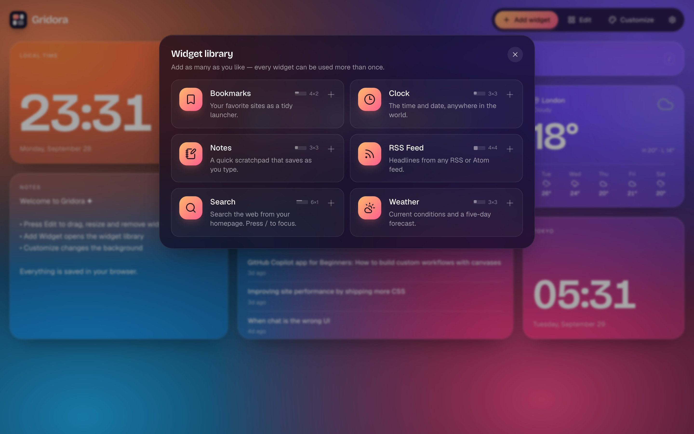
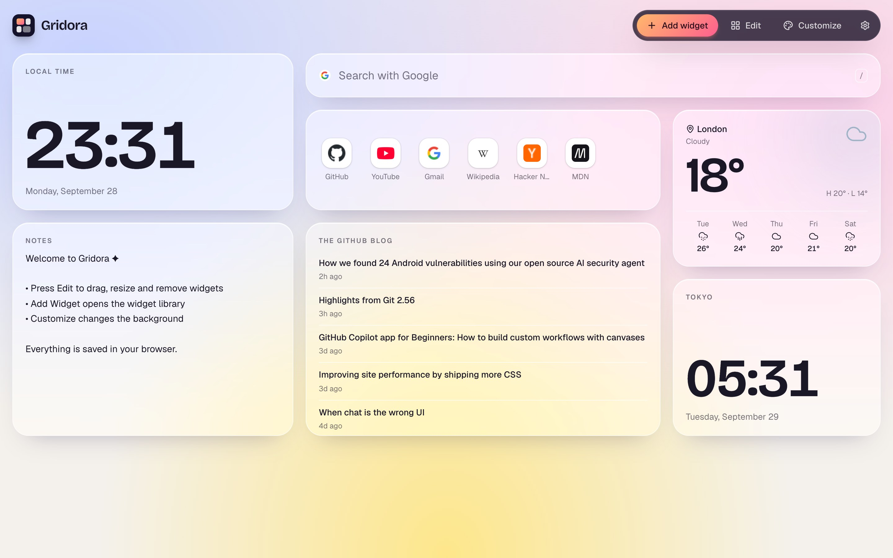

# Gridora

**Your web, arranged your way.**

> [!WARNING]
> **Gridora is a work in progress.** It's early and changing quickly, so expect bugs, rough edges and breaking changes between versions, including to the saved dashboard format. Found a problem? [Open an issue](https://github.com/GalHavshush/gridora/issues). Bug reports are very welcome.

Gridora is an open-source, widget-based personal homepage, a modern spiritual successor to iGoogle. Arrange clocks, weather, notes, bookmarks, feeds and search on a full-screen snapping grid. Drag, resize and restyle everything; it all stays in your browser.

<a href="https://gridora-six.vercel.app"></a>

<p align="center"><a href="https://gridora-six.vercel.app"><b>Try the live demo →</b></a></p>

- **Snapping 12-column grid:** widgets always land on grid cells. They never float freely.
- **Edit mode:** drag to move, pull a corner to resize, remove or configure widgets, and see the cell grid while you arrange.
- **Pluggable widgets:** each widget is a self-contained folder. Drop one in and it shows up in the widget library.
- **Multiple instances:** add two clocks in different time zones, three feeds, or as many notes as you like.
- **Backgrounds:** gradients, solid colors or wallpaper images, with glass, light or dark widget cards.
- **No backend:** it's a static site. The layout is saved to `localStorage` and can be exported or imported as JSON.

## Screenshots


<table>
  <tr>
    <td width="50%"><br /><sub><b>Edit mode.</b> Drag, resize and snap to the cell grid.</sub></td>
    <td width="50%"><br /><sub><b>Widget library.</b> Generated from the widget registry.</sub></td>
  </tr>
  <tr>
    <td width="50%"><br /><sub><b>Customize.</b> Gradients, colors, wallpapers and card styles.</sub></td>
    <td width="50%"><br /><sub><b>Light backgrounds.</b> Widgets adapt their text color automatically.</sub></td>
  </tr>
</table>

<p align="center">
  <br />
  <sub><b>Small screens.</b> Widgets stack into one column.</sub>
</p>

## Quick start

```bash
git clone https://github.com/GalHavshush/gridora.git
cd gridora
npm install
npm run dev
```

| Script              | What it does                    |
| ------------------- | ------------------------------- |
| `npm run dev`       | Start the dev server            |
| `npm run build`     | Type-check and build to `dist/` |
| `npm run preview`   | Serve the production build      |
| `npm test`          | Run the unit tests (Vitest)     |
| `npm run lint`      | Lint with oxlint                |

### Deploy

`npm run build` produces a fully static `dist/` folder.

- **Vercel:** import the repo. The Vite preset works as-is.
- **Cloudflare Pages:** build command `npm run build`, output directory `dist`.
- Any static host (Netlify, GitHub Pages, S3) works the same way.

## Tech stack

React 19 · TypeScript · Vite · Tailwind CSS v4 · Zustand · react-grid-layout v2 · Motion (Framer Motion) · lucide icons

## Architecture

```
src/
  app/            Screens and panels: Dashboard, WidgetGrid, WidgetPicker, settings/customize drawers
  components/     Shared UI: WidgetContainer (widget chrome), Toolbar, Sheet, SettingField, Background
  widget-sdk/     The contract between Gridora and widgets: types, registry, helpers
  widgets/        One folder per widget (clock, weather, notes, bookmarks, rss, search)
  store/          Zustand dashboard store, layout helpers, snapshot validation
  services/       Side effects behind small seams: persistence, weather provider, RSS fetching
  themes/         Background presets and card styles
```

**How a widget gets on screen:**

1. `widget-sdk/registry.ts` collects every `src/widgets/*/manifest.ts` with `import.meta.glob`, so there is no central list to edit.
2. The store holds **widget instances**: `{ id, type, position: { x, y, w, h }, settings }`. `type` points at a manifest, and `id` is unique per instance (`notes-a81b2`).
3. `WidgetGrid` maps instances to a react-grid-layout layout and renders each one inside a `WidgetContainer`.
4. `WidgetContainer` looks up the manifest, merges the manifest's default settings with the instance's stored settings, and renders the widget component. It also owns the chrome: the card surface, the edit controls, and an error boundary so one broken widget can't take down the page.
5. Layout changes from dragging and resizing go back into the store, and the store persists them automatically.

**State and persistence.** `store/dashboardStore.ts` is a single Zustand store: instances, background, card style and edit mode. The persisted part (a `DashboardSnapshot`) is saved through `services/persistence/storage.ts`, which is the only file that knows about `localStorage`. To add cloud sync later, implement another Zustand `StateStorage` (async is fine) and plug it in there. UI code won't change.

**Responsive behavior.** Screens 640 px and wider use the 12-column grid. Row height scales with width, so a layout keeps its proportions from laptop to tablet. Narrower screens show a single-column stack derived from the saved layout, and the desktop arrangement isn't changed.

## Create a widget

A widget is a folder with a component and a manifest. Here's a complete "Counter" widget.

**1. `src/widgets/counter/CounterWidget.tsx`**

```tsx
import type { WidgetProps } from '@/widget-sdk'

export type CounterSettings = { label: string; count: number }

export function CounterWidget({ settings, updateSettings }: WidgetProps<CounterSettings>) {
  return (
    <div className="flex h-full flex-col items-center justify-center gap-2 p-5">
      <div className="text-sm text-muted">{settings.label}</div>
      <button
        className="font-display text-5xl font-semibold"
        onClick={() => updateSettings({ count: settings.count + 1 })}
      >
        {settings.count}
      </button>
    </div>
  )
}
```

**2. `src/widgets/counter/manifest.ts`**

```ts
import { Plus } from 'lucide-react'
import { defineWidget } from '@/widget-sdk'
import { CounterWidget, type CounterSettings } from './CounterWidget'

export default defineWidget<CounterSettings>({
  id: 'counter', // stored with every instance, so never rename it
  name: 'Counter',
  description: 'Counts things. Click to increment.',
  version: '1.0.0',
  icon: Plus,
  component: CounterWidget,
  defaultSize: { w: 2, h: 2 },
  minSize: { w: 2, h: 2 },
  settings: [
    { key: 'label', label: 'Label', type: 'text', default: 'Coffees today' },
    { key: 'count', label: 'Count', type: 'number', default: 0, min: 0 },
  ],
})
```

**3. That's it.** Run `npm run dev`. "Counter" now appears in the widget library, and its settings drawer is generated from the `settings` schema.

### What your component receives

| Prop             | Description                                                                   |
| ---------------- | ----------------------------------------------------------------------------- |
| `settings`       | Stored settings merged over the defaults in your manifest                     |
| `updateSettings` | Shallow-merges and persists. You can also store content here (Notes does)     |
| `openSettings`   | Opens this instance's settings drawer, which is useful for empty states       |
| `isEditing`      | `true` in edit mode. Content isn't interactive then; the card is a drag handle |
| `size`           | Current size in grid cells, `{ w, h }`, for adapting the layout               |
| `instanceId`     | Unique id of this instance                                                    |

### Settings schema

`text`, `url`, `number` (`min`/`max`/`step`), `toggle`, `select` (`options`), and `list`, which is an editable list of records whose items are described by `fields`. The Bookmarks widget uses `list`.

### Guidelines

- **Theme-aware colors:** use `text-fg`, `text-muted`, `bg-subtle` and `border-line`. They follow the user's card style and background, so your widget looks right on glass, light and dark cards.
- **Size-aware layout:** the card is a CSS container, so you can scale type with `cqi` units (`font-size: clamp(2rem, 20cqi, 6rem)`) or branch on `size`.
- **Data fetching:** `useAsyncData(key, loader, refreshMs)` from `@/widget-sdk` handles loading, errors, aborting and refreshes. Keep API calls in `src/services/` so a provider can be swapped without touching the UI.
- **Empty and error states:** `WidgetMessage` from `@/widget-sdk` renders a consistent message with an optional action.
- **No secrets:** Gridora is a static site, and anything you ship is public. Prefer keyless APIs (like Open-Meteo) or let users enter their own keys in settings.

## Community widgets

Widgets can also be installed at runtime, without rebuilding Gridora. **Add widget → Marketplace** lists the widgets in [gridora-widgets](https://github.com/GalHavshush/gridora-widgets). You can also install any widget by pasting its `manifest.json` URL. That repo covers how to write one.

A community widget is a web page listed in a JSON manifest. The manifest carries the same fields as `defineWidget`, with an `entry` URL in place of a component. Gridora renders the page in a sandboxed iframe with no `allow-same-origin`. The page can't read your dashboard, `localStorage` or other widgets, and it only receives its own settings. The two sides talk over `postMessage`:

| Direction      | Message                                                   |
| -------------- | --------------------------------------------------------- |
| widget → Gridora | `{ type: 'gridora:ready' }`, `{ type: 'gridora:updateSettings', patch }`, `{ type: 'gridora:openSettings' }` |
| Gridora → widget | `{ type: 'gridora:state', settings, size, isEditing, theme }`, sent on `ready` and on every change |

Gridora renders the settings drawer from the manifest's `settings` schema, just as it does for built-in widgets. Entries must be `https` URLs; plain `http` is allowed on `localhost` for development. Set `VITE_WIDGET_CATALOG_URL` to point the Marketplace at a different catalog.

## Built-in widgets

| Widget    | Notes                                                                                    |
| --------- | ---------------------------------------------------------------------------------------- |
| Clock     | 12/24-hour, seconds, any time zone, custom label                                         |
| Weather   | Live data from [Open-Meteo](https://open-meteo.com) (free, no API key); °C/°F; 5-day forecast |
| Notes     | Autosaves per instance                                                                   |
| Bookmarks | Launcher grid with favicons, or your own emoji or image icons                            |
| RSS Feed  | RSS 2.0 and Atom, any public feed (see below)                                            |
| Search    | Google, Bing or DuckDuckGo. Press `/` to focus                                           |

### How RSS works without a backend

Browsers only let a page read a feed from another site if that site sends CORS headers (`Access-Control-Allow-Origin`). Many feeds don't. Gridora reads feeds directly when it can. When the browser blocks a feed, Gridora automatically retries through [rss2json.com](https://rss2json.com), a free public service that returns the feed as JSON with CORS enabled. Any public RSS or Atom feed works, with no setup and no API key.

The free tier limits how many items and requests you get. All feed logic lives in `src/services/rss/fetchFeed.ts`, so a future Gridora backend can replace the fallback with its own proxy by changing that one function.

## Privacy

Everything you configure stays in your browser's `localStorage`. Gridora has no analytics and no accounts. Widgets request only what they display: weather from Open-Meteo, the feeds you add (feeds that block browsers are fetched through rss2json.com, which sees the feed URL), and bookmark and search-engine favicons from Google's favicon service.

## Roadmap

The architecture is built so these can be added without rewriting the frontend, and Gridora will keep working fully offline from them:

- Optional accounts and cloud layout sync (FastAPI + PostgreSQL behind the persistence seam)
- Multiple dashboard pages
- Shareable dashboard layouts (export/import is the first step)
- Integrations: Google Calendar, Gmail, GitHub, Spotify, Notion, Home Assistant
- Dedicated mobile layouts

## Contributing

Contributions are welcome, and new widgets especially. See [CONTRIBUTING.md](CONTRIBUTING.md).

## License

[MIT](LICENSE)
